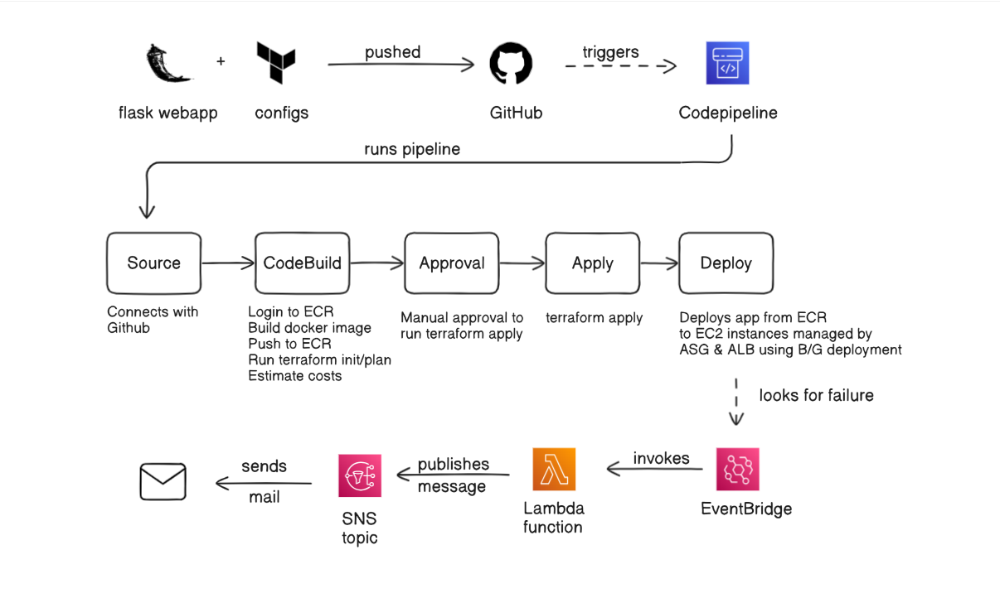

# Automated WebApp Deployment using Terraform and AWS  CI/CD stack

## Architecture Diagram:


## Project Overview

This project demonstrates a fully automated CI/CD pipeline to provision and deploy a containerized web application using **Terraform** and **AWS native DevOps tools**, including **CodePipeline**, **CodeBuild**, and **CodeDeploy**. 

The goal is to build a scalable, observable, and highly available infrastructure aligned with **SRE** principles such as **idempotency**, **automation**, **rollback capability**.

By combining **Infrastructure as Code (IaC)** with a CI/CD workflow, this project ensures consistent deployments and minimal manual intervention. The pipeline provisions infrastructure, builds and pushes a Docker image to **Amazon ECR**, and deploys it to an **EC2 Auto Scaling Group** behind an **Application Load Balancer (ALB)**.

The deployed application is a lightweight **Flask** app serving a static "Hello from DevOps!" page.

## Pre-requisites

- Terraform
- AWS CLI

## Setup Instructions

First we need to clone the project:
```
git clone git@github.com:scoder17/webapp-deploy-aws.git
cd webapp-deploy-aws
```

We will then configure the AWS with credentials:

```
aws configure
```

Ensure to give correct AWS Access Key ID and AWS Secret Access Key  

---
Once this is done we can go ahead with S3 and DynamoDB creation which will act as remote backend for our Terraform project.

```
aws s3api create-bucket --bucket webapp-backend-tf-state-bucket-1234567 --region us-east-1
aws dynamodb create-table --table-name webapp-backend-terraform-lock-table --attribute-definitions AttributeName=LockID,AttributeType=S --key-schema AttributeName=LockID,KeyType=HASH --billing-mode PAY_PER_REQUEST
```
We can create these things using AWS console as well, just remember to mention the right names in the `terraform/backend.tf`. 

---
We now have to add GitHub and Infracost token to SSM, so that pipeline can have access to our GitHub repo and an estimated cost can be generated during execution as well.

```
aws ssm put-parameter --name "/github/token" --value "ghp_XXX" --type "SecureString"
aws ssm put-parameter --name "/infracost/api_key" --value "ico-XXX" --type "SecureString"
```
This can be added via AWS console as well by going to Systems Manager->Parameter store.

---
Once these all things are done, we are good to go to next steps:

```
cd terraform
terraform init
terraform plan
terraform apply
```
These commands initialize the Terraform configuration, preview the changes to be made, and then apply those changes to create or modify our AWS infrastructure.

---
Once this is done, you can go to AWS console and check the resources and services which has been created. You can view the entire pipeline by navigating to the AWS CodePipeline console.


## How to Trigger Deployments?

Deployments are automatically triggered whenever changes are pushed to the connected **GitHub repository**.

### Trigger Methods

- **GitHub Source:**
  - Push a commit to the `master` branch.
  - CodePipeline will detect the change and begin the pipeline execution.
- **Release Change/Create trigger** from Codepipeline console

> You can monitor the progress and status of each stage in the [AWS CodePipeline console](https://console.aws.amazon.com/codepipeline).

---

## Rollback Approach

To maintain reliability, this project includes a rollback mechanism based on **CodeDeploy health checks** and **Auto Scaling Group settings**.

### Rollback Logic

- **CodeDeploy Failure Handling:**
  - If a deployment fails (e.g., due to failing health checks or container errors), CodeDeploy automatically rolls back to the **previous working revision**.
  - The rollback is triggered by lifecycle hooks in the `appspec.yml` file and health check monitoring from the ALB.

---

# How did I approach this project?

I started with configuring S3, Dynamodb, SSM parameters required for the project after `aws configure`.

Next, I went with setting up Terraform configurations for the infra which will be required for our project, so I created a module named `infra` which provisions base infra required for the project.

Meanwhile, I created a basic flask app serving `Hello from Devops!` with **multi-staged** Dockerfile.

Once the base infrastructure was provisioned successfully, I created one more module named `ci_cd` to provision infrastructure required related to pipelines. I added `buildspec-plan.yml`,`buildspec-apply.yml`, `appsec.yml` and other scripts like `start.py`, `stop.py` and `validate.py` as well.

Once this was done, I created a module `notification_alerts` which uses SNS to send the mails to set mails.

Everything worked after few bug and scripts fixes.


### Flask app

It is a simple webapp that serves a static message: "Hello from DevOps!" on **port 80**.
It is containerized using a multi-stage Dockerfile for a lightweight and efficient deployment. 

### Modules
You can refer to README present in each modules. It describes itself in detail.

### Scripts
- ### buildspec-plan.yml
  - Authenticate with ECR and login using AWS CLI.
  - Install Terraform and Infracost for infrastructure provisioning and cost estimation.
  - Build the Docker image for the Flask app and push it to ECR.
  - Run Terraform commands (`init`, `plan`) to prepare infrastructure.
  - Generate a cost report using Infracost.
  - Package build artifacts (`appspec.yml`, Terraform code, and scripts) for deployment via CodePipeline.

- ### buildspec-apply.yml

  - Installs Terraform CLI
  - Initializes Terraform inside the `terraform/` directory.
  - Applies the previously saved Terraform plan file `tfplan.binary`.
  - Includes `appspec.yml` and deployment scripts as build artifacts for CodeDeploy.

- ### appsec.yml

  - Copies source files to `/home/ec2-user/app` on the EC2 instance.
  - Defines lifecycle hooks to control the deployment flow:
    - **ApplicationStop**: Runs `scripts/stop.py` to stop any existing app process.
    - **AfterInstall**: Runs `scripts/start.py` to start the new application.
    - **ValidateService**: Runs `scripts/validate.py` to check if the app is healthy.

- ### start.py
  - Fetch the EC2 instance's AWS account ID using the instance metadata service.
  - Authenticate with Amazon ECR by retrieving and using a login token.
  - Pull the latest Docker image from your ECR repository.
  - Run the container in detached mode on port 80, naming the container app.

- ### stop.py
  - Stop the running Docker container named app, if it exists.
  - Remove the stopped container to prepare for a fresh deployment.

- ### validate.py
  - Check if the application is accessible via http://localhost.
  - Retry up to 5 times with a 5-second delay between attempts.
  - Consider the app healthy if it returns HTTP status 200.
  - Exit with a failure if the app does not respond successfully within the retry limit.
---

## SRE Practices Applied

- **Idempotent infrastructure** with Terraform
- **Automated deployments** triggered by GitHub or S3
- **Health-check-based updates** using CodeDeploy hooks
- **Rollback mechanism** on failed deployments
- **Observability** with CloudWatch logs and alarms